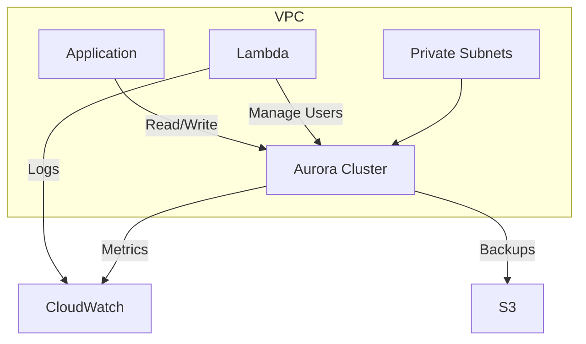

# Aurora Serverless (v1) Terraform Module

Deploy and manage production-grade Aurora Serverless clusters with automated user management and security best practices.

## Features
- 🛡️ **Security**: KMS encryption, IAM least privilege, random credentials
- ⚡ **Serverless**: Auto-scaling from 0.5 to 256 ACUs
- 🔄 **Automation**: Idempotent user management via Lambda
- 📦 **Modular**: Reusable across environments
- 🔍 **Observable**: CloudWatch logging and outputs

## Usage
```hcl
module "prod_db" {
  source = "github.com/your-org/terraform-aws-aurora-serverless?ref=v2.1.0"

  # Required
  name_prefix        = "prod-core"
  aws_region         = "us-west-2"
  engine_name        = "aurora-postgresql" # aurora-mysql
  database_name      = "orders_db"
  vpc_id             = "vpc-09876"
  subnet_ids         = ["subnet-123", "subnet-456"]
  
  # Optional
  allowed_cidr_blocks = ["10.1.0.0/16"]
  master_username    = "db_admin"
  max_capacity       = 32
  min_capacity       = 2
  storage_encrypted  = true
  kms_key_id         = "arn:aws:kms:us-west-2:123456789012:key/abcd1234"
}

output "db_connection" {
  value = "psql -h ${module.prod_db.aurora_cluster_endpoint} -U db_admin -d orders_db"
  sensitive = true
}
```

## Inputs

| Name | Description | Type | Default |
|------|-------------|------|---------|
| `name_prefix` | Resource prefix | string | Required |
| `engine_name` | `aurora-postgresql` or `aurora-mysql` | string | Required |
| `database_name` | Initial database name | string | Required |
| `vpc_id` | Target VPC ID | string | Required |
| `subnet_ids` | Subnets for DB group | list(string) | Required |
| `allowed_cidr_blocks` | Allowed IP ranges | list(string) | `["10.0.0.0/16"]` |
| `master_username` | Admin username | string | `"admin"` |
| `auto_pause` | Enable auto-pause | bool | `true` |
| `max_capacity` | Max ACUs (0.5-256) | number | `16` |
| `min_capacity` | Min ACUs (0.5-256) | number | `1` |
| `seconds_until_auto_pause` | Inactivity timeout | number | `300` |
| `storage_encrypted` | Enable encryption | bool | `true` |
| `kms_key_id` | Custom KMS key ARN | string | `null` |

## Outputs

- `aurora_cluster_endpoint` - Cluster writer endpoint
- `database_name` - Initial database name  
- `security_group_id` - DB security group ID
- `lambda_function_name` - User management Lambda
- `db_subnet_group_name` - Subnet group name
- `lambda_iam_role_arn` - Lambda execution role ARN
- `master_password` - Admin password (sensitive)
- `readonly_password` - Read-only user password (sensitive)
- `readwrite_password` - Read-write user password (sensitive)

## Operational Guide

### 🔐 Security Best Practices
- Rotate passwords quarterly using `terraform taint`
- Use VPC endpoints for Lambda-RDS communication
- Enable CloudTrail for API monitoring
- Restrict IAM policies to least privilege

### 💰 Cost Optimization
- **Dev/Test**: `min_capacity = 0.5` + `auto_pause = true`
- **Production**: Set `min_capacity` to baseline load
- Use Reserved Capacity for predictable workloads

### 🚨 Troubleshooting

**Common Issues:**
```bash
# Lambda timeout
Error: Task timed out after 60.03 seconds

# Fix: Increase timeout in aws_lambda_function
timeout = 120
```

**Connection Troubles:**
1. Verify security group allows inbound from client IP
2. Check route tables for subnet accessibility 
3. Validate cluster status is "available"

**User Management:**
```bash
# View Lambda logs
awslocal logs tail /aws/lambda/${module.aurora.lambda_function_name}

# Manual user creation
awslocal rds-data execute-statement --resource-arn $CLUSTER_ARN --database $DB_NAME --sql "CREATE USER ..."
```

## Architecture



## Requirements

- Terraform >= 1.5
- AWS Provider >= 5.0
- Node.js 18.x (Lambda runtime)
- LocalStack 2.0+ (for local testing)

## Development

```bash
# Local testing
export AWS_ACCESS_KEY_ID=test
export AWS_SECRET_ACCESS_KEY=test

cd examples/basic-usage
tflocal init
tflocal apply -auto-approve

# Get connection details
tflocal output -json | jq 'with_entries(.value |= .value)'
```