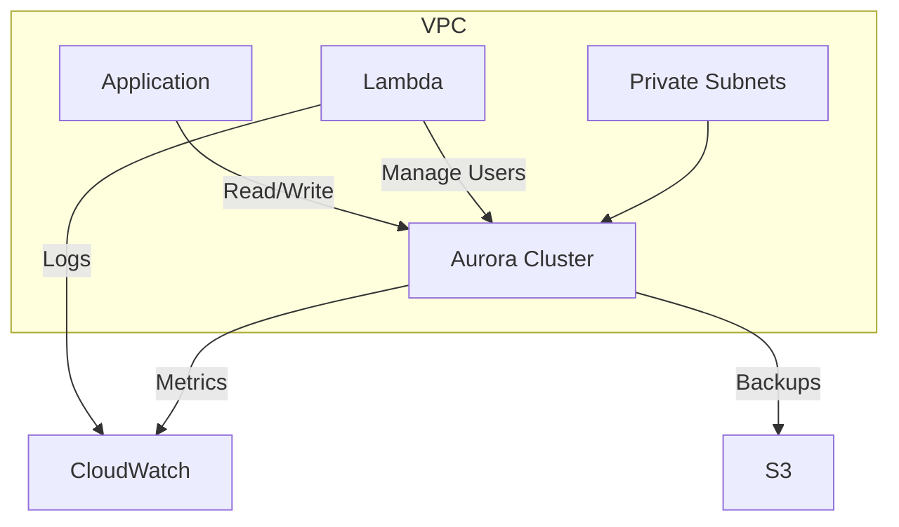

# Aurora Serverless Terraform Module

Supports both **v1** and **v2** with unified interface.

## Features
- 🛡️ **Security**: KMS encryption, IAM least privilege
- ⚡ **Serverless**: v1 (0.5-256 ACU) and v2 (0.5-128 ACU)
- 🔄 **Automation**: User management via Lambda
- 📦 **Multi-AZ**: Built-in for v2 deployments

## Usage
```hcl
module "db" {
  source = "github.com/your-org/terraform-aws-aurora-serverless?ref=v3.0.0"

  # Required
  name_prefix        = "prod-core"
  aws_region         = "us-west-2"
  engine_name        = "aurora-postgresql" # aurora-mysql
  serverless_version = "v2"                # v1 or v2
  database_name      = "orders_db"
  vpc_id             = "vpc-09876"
  subnet_ids         = ["subnet-123", "subnet-456"]
  
  # Version-specific
  engine_version     = var.serverless_version == "v2" ? "13.6" : null
  min_capacity       = var.serverless_version == "v2" ? 0.5 : 1
  max_capacity       = var.serverless_version == "v2" ? 64 : 32

  # Common
  storage_encrypted  = true
}
```

## Version Comparison
| Feature                | v1                      | v2                      |
|------------------------|-------------------------|-------------------------|
| **Engine Mode**        | `serverless`            | `provisioned`           |
| **Min Capacity**       | 1 ACU                   | 0.5 ACU                 |
| **Max Capacity**       | 256 ACU                 | 128 ACU                 |
| **Auto Pause**         | Supported               | Not Available           |
| **Multi-AZ**           | No                      | Yes                     |

## Inputs
```hcl
variable "serverless_version" {
  description = "v1 or v2"
  type        = string
  default     = "v2"
  validation {
    condition     = contains(["v1", "v2"], var.serverless_version)
    error_message = "Valid values: v1, v2"
  }
}

variable "engine_version" {
  description = "Required for v2 (e.g., '13.6')"
  type        = string
  default     = null
}
```

Full documentation: [AWS Aurora Serverless v2](https://docs.aws.amazon.com/AmazonRDS/latest/AuroraUserGuide/aurora-serverless-v2.html)

## Outputs

- `aurora_cluster_endpoint` - Cluster writer endpoint
- `database_name` - Initial database name  
- `security_group_id` - DB security group ID
- `lambda_function_name` - User management Lambda
- `db_subnet_group_name` - Subnet group name
- `lambda_iam_role_arn` - Lambda execution role ARN
- `master_password` - Admin password (sensitive)
- `readonly_password` - Read-only user password (sensitive)
- `readwrite_password` - Read-write user password (sensitive)

## Operational Guide

### 🔐 Security Best Practices
- Rotate passwords quarterly using `terraform taint`
- Use VPC endpoints for Lambda-RDS communication
- Enable CloudTrail for API monitoring
- Restrict IAM policies to least privilege

### 💰 Cost Optimization
- **Dev/Test**: `min_capacity = 0.5` + `auto_pause = true`
- **Production**: Set `min_capacity` to baseline load
- Use Reserved Capacity for predictable workloads

### 🚨 Troubleshooting

**Common Issues:**
```bash
# Lambda timeout
Error: Task timed out after 60.03 seconds

# Fix: Increase timeout in aws_lambda_function
timeout = 120
```

**Connection Troubles:**
1. Verify security group allows inbound from client IP
2. Check route tables for subnet accessibility 
3. Validate cluster status is "available"

**User Management:**
```bash
# View Lambda logs
awslocal logs tail /aws/lambda/${module.aurora.lambda_function_name}

# Manual user creation
awslocal rds-data execute-statement --resource-arn $CLUSTER_ARN --database $DB_NAME --sql "CREATE USER ..."
```

## Production Readiness

### ✅ Implemented
- **Security Fundamentals**
  - KMS encryption at rest
  - IAM role with least privilege
  - Random password generation
  - Security group lockdown
- **Operational Essentials**
  - Idempotent user management
  - Basic CloudWatch logging
  - Cross-version support (v1/v2)
  - Sensitive output handling

### 🚧 Roadmap
- **Backup & Recovery**
  - [ ] Automated snapshot exports to S3
  - [ ] Point-in-time recovery configuration
  - [ ] Cross-region replication
- **Monitoring**
  - [ ] Enhanced CloudWatch metrics
  - [ ] Performance Insights integration
  - [ ] Anomaly detection
- **Hardening**
  - [ ] Parameter groups customization
  - [ ] Maintenance windows
  - [ ] Automated failover testing

### 🔧 Quick Wins
```hcl
# Enable performance insights
resource "aws_rds_cluster" "aurora_serverless" {
  # ... existing config ...
  enable_performance_insights = true
  performance_insights_retention_period = 7
}

# Add deletion protection
deletion_protection = var.production
```

### ▶️ Next Steps
1. Implement automated drift detection
2. Add load-based auto-scaling policies
3. Integrate with Secrets Manager rotation
4. Set up VPC endpoints for private access

[Production Checklist](.github/CHECKLIST.md) | [Security Policy](SECURITY.md)

## Architecture



## Requirements

- Terraform >= 1.5
- AWS Provider >= 5.0
- Node.js 18.x (Lambda runtime)
- LocalStack 2.0+ (for local testing)

## Development

```bash
# Local testing
export AWS_ACCESS_KEY_ID=test
export AWS_SECRET_ACCESS_KEY=test

cd examples/basic-usage
tflocal init
tflocal apply -auto-approve

# Get connection details
tflocal output -json | jq 'with_entries(.value |= .value)'
```